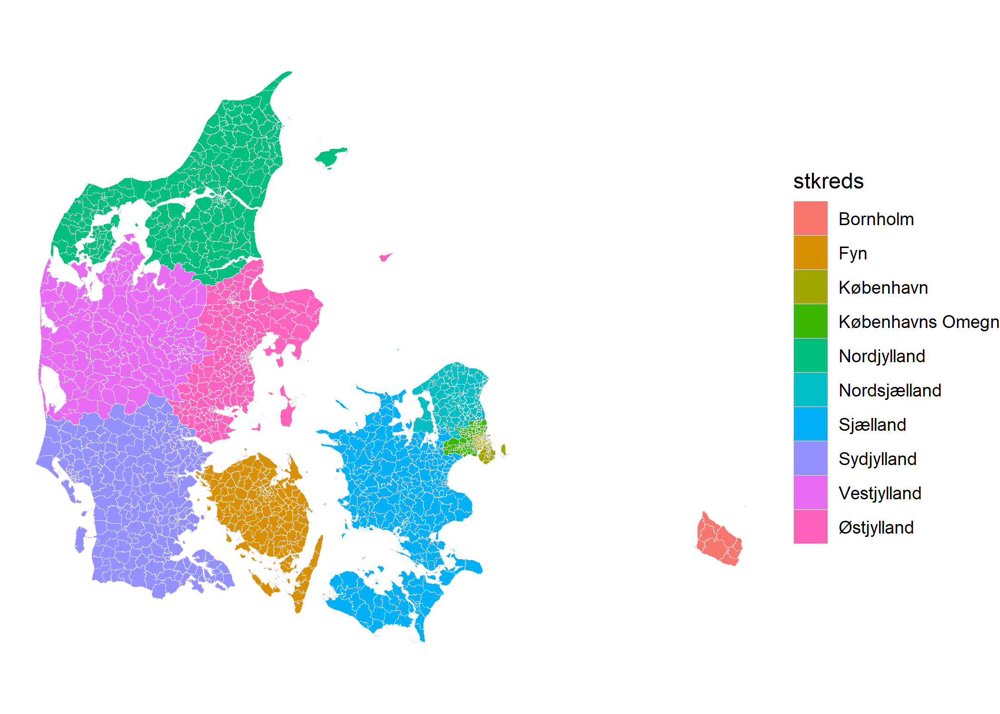

<!-- README.md is generated from README.Rmd. Please edit that file -->

# voters

<!-- badges: start -->

[](https://www.codefactor.io/repository/github/jvieroe/voters)
[](https://github.com/jvieroe/voters/actions)
[-blue.svg)](https://cran.r-project.org/web/licenses/GPL%20(%3E=%203))
[](https://github.com/https://github.com/jvieroe/voters/commits/main)
[](https://lifecycle.r-lib.org/articles/stages.html#experimental)
<!-- badges: end -->

# Introduction

The purpose of `voters` is to provide easy access to data on Danish
polling stations.

## Terms of use

The primary data is provided through [Danmarks Adressers Web API
(DAWA)](https://dawadocs.dataforsyningen.dk/). DAWA is developed and run
by the [Danish Agency for Data Supply and Efficiency
(SDFE)](https://eng.sdfe.dk/). SDFE’s [terms of
use](https://download.kortforsyningen.dk/content/vilk%C3%A5r-og-betingelser)
apply.

Additional data is provided the [Danish Election
Database](https://valgdatabase.dst.dk/?lang=en).

## Usage

Download data on Danish polling stations using the `voters::getPS()`
function:

``` r
library(voters)
```

``` r
df <- getPS()
df
#> Simple feature collection with 1384 features and 23 fields
#> Geometry type: MULTIPOLYGON
#> Dimension:     XY
#> Bounding box:  xmin: 8.07251 ymin: 54.55908 xmax: 15.1974 ymax: 57.75257
#> Geodetic CRS:  WGS 84
#> # A tibble: 1,384 x 24
#>    dagi_ID nummer navn   station   st_id  st_add   st_lon st_lat muni_code muni 
#>  * <chr>   <chr>  <chr>  <chr>     <chr>  <chr>     <dbl>  <dbl> <chr>     <chr>
#>  1 707732  1      1. Øs~ Idrætshu~ 0a3f5~ Gunnar ~   12.6   55.7 0101      Købe~
#>  2 711932  2      1. No~ Strandve~ 0a3f5~ Sionsga~   12.6   55.7 0101      Købe~
#>  3 704936  3      1. Syd Remisen   0a3f5~ Blegdam~   12.6   55.7 0101      Købe~
#>  4 706160  5      1. Ve~ Nørre Fæ~ 0a3f5~ Biskop ~   12.6   55.7 0101      Købe~
#>  5 710802  6      1. No~ Kildevæl~ 0a3f5~ Bellman~   12.6   55.7 0101      Købe~
#>  6 711204  7      2. Su~ Sundby I~ 0a3f5~ England~   12.6   55.7 0101      Købe~
#>  7 706166  8      2. No~ Amager F~ 0a3f5~ Sundhol~   12.6   55.7 0101      Købe~
#>  8 706562  9      2. Syd Ørestad ~ 20d73~ Arne Ja~   12.6   55.6 0101      Købe~
#>  9 712286  10     2. Ve~ Skolen p~ 0a3f5~ Artille~   12.6   55.7 0101      Købe~
#> 10 711926  11     3. In~ Rådhusha~ 0a3f5~ Rådhusp~   12.6   55.7 0101      Købe~
#> # ... with 1,374 more rows, and 14 more variables: regi_code <chr>, regi <chr>,
#> #   kreds_id <chr>, kreds <chr>, stkreds_id <chr>, stkreds <chr>,
#> #   valg_ld_l <chr>, valg_ld <chr>, edit <chr>, geo_edit <chr>, geo_v <int>,
#> #   vcent_lon <dbl>, vcent_lat <dbl>, geometry <MULTIPOLYGON [°]>
```

As a default, data is downloaded as a spatial dataset of type
`"sf", "tibble"`:

``` r
class(df)
#> [1] "sf"         "tbl_df"     "tbl"        "data.frame"
```

``` r
library(ggplot2)
library(Manu)
library(ggpubr)

df %>% 
  #filter(stkreds %in% c("København", "Københavns Omegn")) %>% 
  ggplot(data = .) +
  geom_sf(aes(fill = regi),
          color = "grey90",
          size = .0000000001) +
  scale_fill_manual(values = Manu::get_pal("Takahe"),
                      name = "") +
  theme_void() +
  ggpubr::theme_transparent()
```



To download a non-spatial version simply use the `spatial` argument:

``` r
df_raw <- getPS(spatial = FALSE)
class(df_raw)
#> [1] "tbl_df"     "tbl"        "data.frame"
```

## Installation

You can install the development version from
[GitHub](https://github.com/) with:

``` r
if(!require("devtools")) install.packages("devtools")
library(devtools)
devtools::install_github("jvieroe/voters")
```

# Acknowledgements

-   [Danmarks Adressers Web API
    (DAWA)](https://dawadocs.dataforsyningen.dk/) for the data and the
    API functionality
-   [Den Danske Valgdatabase](https://valgdatabase.dst.dk/) for data
-   Frederik Hjorth ([fghjorth](http://fghjorth.github.io/)) and Bo
    Schwartz Madsen
    ([BoSchwartz](https://twitter.com/boschwartz?lang=en)) for
    development ideas
-   The `R` Core Team for developing and maintaining the language
