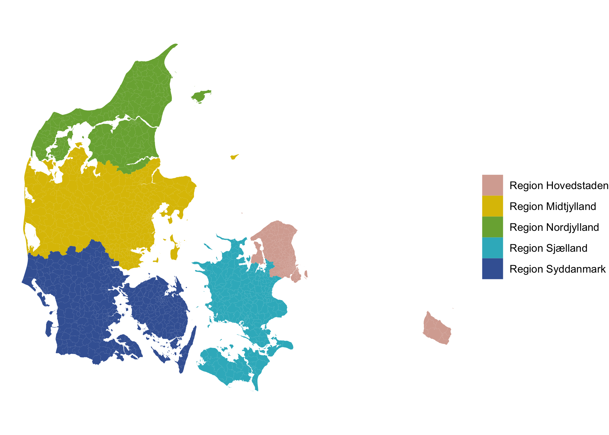

<!-- README.md is generated from README.Rmd. Please edit that file -->

# voters 

<!-- badges: start -->

[](https://www.codefactor.io/repository/github/jvieroe/voters)
[](https://github.com/jvieroe/voters/actions)
[-blue.svg)](https://cran.r-project.org/web/licenses/GPL%20(%3E=%203))
[](https://github.com/https://github.com/jvieroe/voters/commits/main)
[](https://lifecycle.r-lib.org/articles/stages.html#stable)
[](https://github.com/https://github.com/jvieroe/voters)
[](https://app.codecov.io/gh/jvieroe/voters?branch=main)
<!-- badges: end -->

# Introduction

The purpose of `voters` is to provide easy access to data on Danish
polling stations.

## Terms of use

The primary data is provided through [Danmarks Adressers Web API
(DAWA)](https://dawadocs.dataforsyningen.dk/). DAWA is developed and run
by the [Danish Agency for Data Supply and Efficiency
(SDFE)](https://eng.sdfe.dk/). SDFE’s [terms of
use](https://download.kortforsyningen.dk/content/vilk%C3%A5r-og-betingelser)
apply.

Additional data is provided by the [Danish Election
Database](https://valgdatabase.dst.dk/?lang=en).

## Usage

Download data on Danish polling stations using the `voters::getPS()`
function:

``` r
library(voters)
```

``` r
df <- getPS()
df
#> Simple feature collection with 1384 features and 24 fields
#> Geometry type: MULTIPOLYGON
#> Dimension:     XY
#> Bounding box:  xmin: 8.07251 ymin: 54.55908 xmax: 15.1974 ymax: 57.75257
#> Geodetic CRS:  WGS 84
#> # A tibble: 1,384 × 25
#>    dagi_id  ps_id number name   station  st_id   st_add  st_lon st_lat muni_code
#>    <chr>    <int> <chr>  <chr>  <chr>    <chr>   <chr>    <dbl>  <dbl>     <dbl>
#>  1 707732      NA 1      1. Øs… Idrætsh… 0a3f50… Gunnar…   12.6   55.7       101
#>  2 711932  101002 2      1. No… Strandv… 0a3f50… Sionsg…   12.6   55.7       101
#>  3 704936  101003 3      1. Syd Remisen  0a3f50… Blegda…   12.6   55.7       101
#>  4 706160  101005 5      1. Ve… Nørre F… 0a3f50… Biskop…   12.6   55.7       101
#>  5 710802  101006 6      1. No… Kildevæ… 0a3f50… Bellma…   12.6   55.7       101
#>  6 711204  101007 7      2. Su… Sundby … 0a3f50… Englan…   12.6   55.7       101
#>  7 706166  101008 8      2. No… Amager … 0a3f50… Sundho…   12.6   55.7       101
#>  8 706562  101009 9      2. Syd Ørestad… 20d737… Arne J…   12.6   55.6       101
#>  9 712286  101010 10     2. Ve… Skolen … 0a3f50… Artill…   12.6   55.7       101
#> 10 711926  101011 11     3. In… Rådhush… 0a3f50… Rådhus…   12.6   55.7       101
#> # … with 1,374 more rows, and 15 more variables: muni <chr>, regi_code <dbl>,
#> #   regi <chr>, kreds_id <chr>, kreds <chr>, stkreds_id <chr>, stkreds <chr>,
#> #   valg_ld_l <chr>, valg_ld <chr>, edit <chr>, geo_edit <chr>, geo_v <int>,
#> #   vcent_lon <dbl>, vcent_lat <dbl>, geometry <MULTIPOLYGON [°]>
```

``` r
library(ggplot2)
library(MetBrewer)

pal <- met.brewer("Isfahan2", type = "discrete")

df %>% 
  ggplot(data = .) +
  geom_sf(aes(fill = regi),
          color = "grey90",
          size = .0000000001) +
  scale_fill_manual(values = pal,
                      name = "") +
  theme_void()
```



## Output specification

### Data format

As a default, data is downloaded as a spatial dataset of type
`"sf", "tibble"`:

``` r
class(df)
#> [1] "sf"         "tbl_df"     "tbl"        "data.frame"
```

To download a non-spatial version simply use the `spatial` argument:

``` r
df_raw <- getPS(spatial = FALSE)
class(df_raw)
#> [1] "tbl_df"     "tbl"        "data.frame"
```

### Polling station `id`

By default, `getPS()` returns an ID variable (`ps_id`). This provides a
way to link the polling station data to election results from the
[Danish Election Database](https://valgdatabase.dst.dk/?lang=en).

Note that as of November 18, 2021, the Danish Election Database has not
been updated to match the updated polling stations provided by
`getPS()`. As a result, some stations remain without a valid ID:

``` r
table(is.na(df$ps_id))
#> 
#> FALSE  TRUE 
#>   821   563
```

Specify `id = FALSE` to export data without the [Danish Election
Database](https://valgdatabase.dst.dk/?lang=en) ID.

## Installation

You can install the development version from
[GitHub](https://github.com/) with:

``` r
if(!require("devtools")) install.packages("devtools")
library(devtools)
devtools::install_github("jvieroe/voters")
```

# Acknowledgements

-   [Danmarks Adressers Web API
    (DAWA)](https://dawadocs.dataforsyningen.dk/) for the data and the
    API functionality
-   [Danish Election Database](https://valgdatabase.dst.dk/?lang=en) for
    data
-   Frederik Hjorth ([fghjorth](http://fghjorth.github.io/)) and Bo
    Schwartz Madsen
    ([BoSchwartz](https://twitter.com/boschwartz?lang=en)) for
    development ideas
-   The `R` Core Team for developing and maintaining the language
